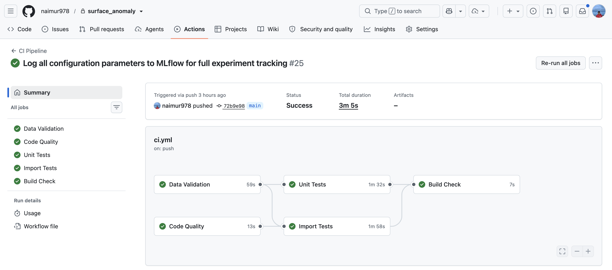
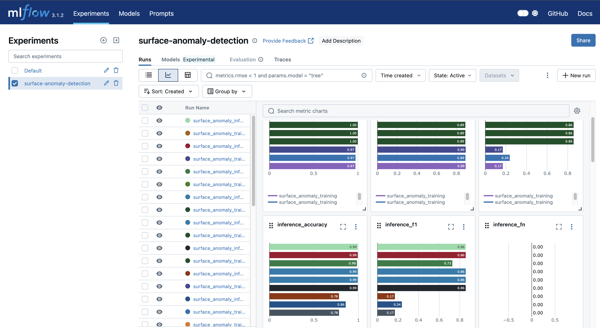
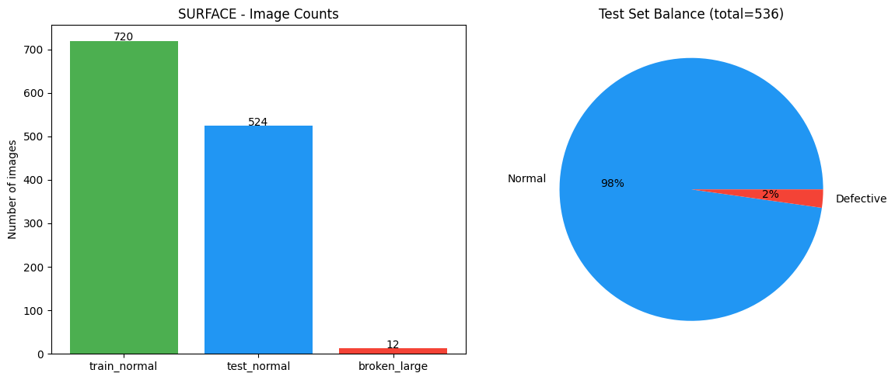
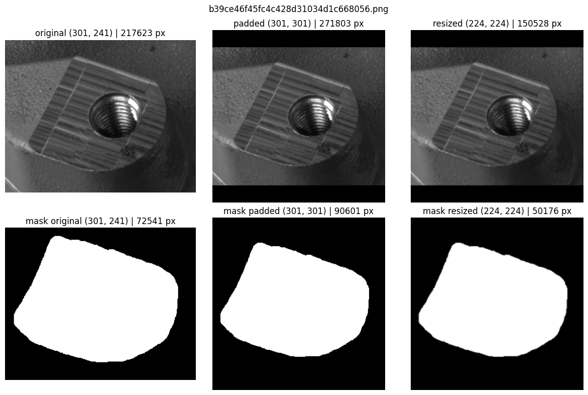
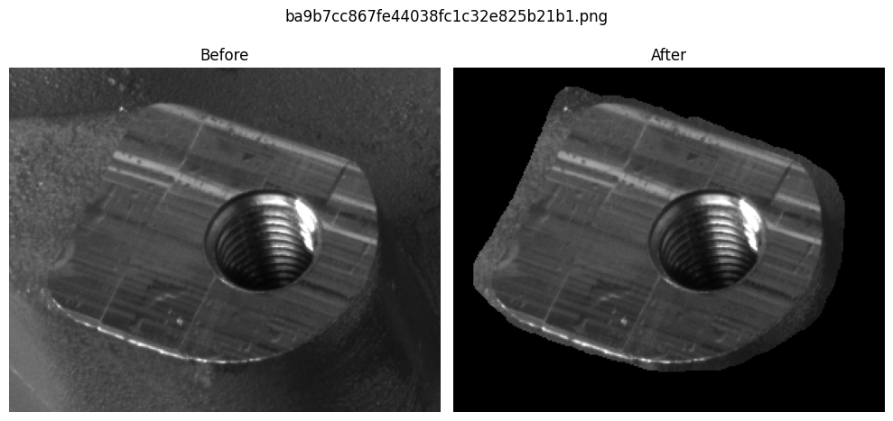
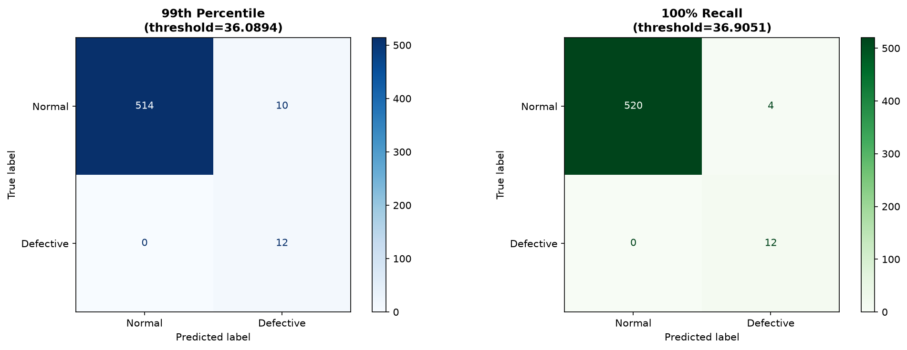
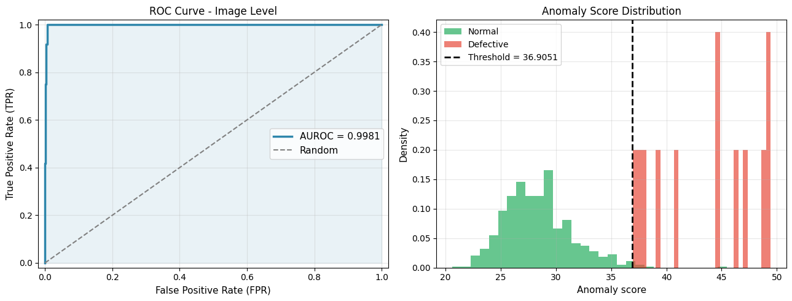
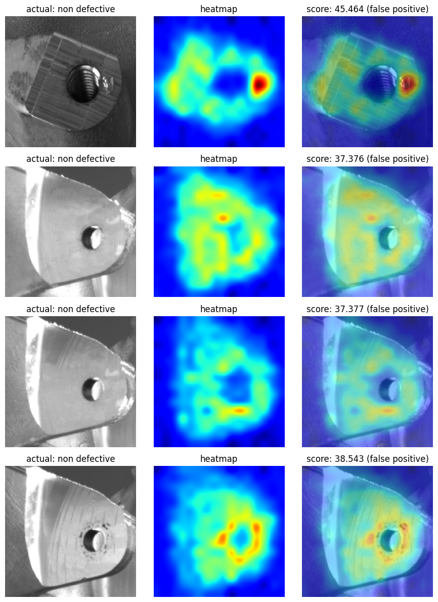

# Surface Anomaly Localization

This work is about detecting and localizing surface defects using DINOv2/EfficientNet feature extractors with k-NN anomaly scoring. Below, I am going to explain my key decisions and rationale as briefly as possible.

**Quick Overview:** If you don't wanna go through all the scripts, I have made a brief notebook at `notebook.ipynb`. You can see my work at a glance in the notebook.

## Table of Contents

1. [Installation](#1-installation)
2. [Usage](#2-usage)
3. [Expected Output](#3-expected-output)
4. [My Plan](#4-my-plan)
   - [4.1 CI/CD Pipeline](#41-cicd-pipeline)
   - [4.2 Baseline Model Comparison](#42-baseline-model-comparison)
5. [Problem Interpretation](#5-problem-interpretation)
6. [Methodology](#6-methodology)
   - [6.1 How It Works](#61-how-it-works)
   - [6.2 Why I Chose Patch-Based Approach](#62-why-i-chose-patch-based-approach)
7. [Key Design Decisions](#7-key-design-decisions)
   - [7.1 Dataset Strategy](#71-dataset-strategy-unified-vs-separate)
   - [7.2 Image Size](#72-image-size-224224)
   - [7.3 Data Augmentation](#73-data-augmentation-none-for-training)
   - [7.4 ROI Masking](#74-roi-masking)
   - [7.5 Feature Extractor](#75-feature-extractor-dinov2)
   - [7.6 Patch Overlap](#76-patch-overlap)
   - [7.7 Coreset Ratio](#77-coreset-sampling-ratio-015)
   - [7.8 Indexing Strategy](#78-indexing-strategy-in-memory-k-nn)
   - [7.9 Number of Neighbors](#79-number-of-neighbors-k9)
   - [7.10 Threshold Strategy](#710-threshold-strategy-100-recall)
8. [Approaches That Didn't Work](#8-approaches-that-didnt-work)
9. [Evaluation Metrics](#9-evaluation-metrics)
10. [Limitations](#10-limitations)
11. [Potential Room for Improvements](#11-potential-room-for-improvements)
    - [11.1 Short-term](#111-short-term)
    - [11.2 Medium-term](#112-medium-term)
    - [11.3 Long-term](#113-long-term)
12. [References](#12-references)

## 1. Installation

1. Extract the dataset folder (`Anomaly Detection Data`) and place it under the `data/` directory:

```bash
# Your dataset structure should look like:
data/
└── Anomaly Detection Data/
    ├── Feature 1/
    │   ├── mask.png
    │   ├── training/
    │   ├── test_ok/
    │   └── test_nok/
    └── Feature 2/
        ├── mask.png
        ├── training/
        ├── test_ok/
        └── test_nok/
```

2. Install Python dependencies:

```bash
pip install -r requirements.txt
```

## 2. Usage

Open **two terminals** and activate virtual environment in both:

**Terminal 1 - MLflow UI (optional, for experiment tracking):**

```bash
source venv/bin/activate  # On Windows: venv\Scripts\activate
python scripts/mlflow_ui.py
```

I have put the code to solve port conflict. So you can directly run the URL on your browser: `http://localhost:5000`

**Terminal 2 - Run Pipeline:**

Before running the pipeline, you can change the parameters in `config/config.yaml` to customize the model, device, feature extractor, and other settings. Make sure to set the device to your hardware (cuda for NVIDIA GPU, mps for MacBook GPU, or cpu as fallback). I put mps as default as I am on MacBook.

Once you put the configuration, you can run:

```bash
source venv/bin/activate  # On Windows: venv\Scripts\activate
python scripts/run_pipeline.py config/config.yaml
```

This will sequentially run: data validation → training → inference.

**Note:** I setup the code for both Python script and Docker. But it was challenging to run the model with GPU in the container. So if you want to run on Docker, you should use CPU. But if you want GPU, run with Python script like I gave above. Since I'm on MacBook, I ran with MPS (Metal Performance Shaders) for GPU acceleration using Python scripts.

**Optional - Docker Command:**

```bash
docker build -t surface_anomaly .
docker run -v $(pwd)/data:/app/data -v $(pwd)/results:/app/results surface_anomaly python scripts/run_pipeline.py config/config.yaml
```

## 3. Expected Output

The pipeline generates:

```
results/
├── models/
│   └── anomaly_localization_surface_dinov2_vitb14.pkl    # Trained model
├── metrics.json                                            # AUROC, F1, threshold
├── figures/
│   ├── confusion_matrix.png                               # Confusion matrix
│   ├── evaluation.png                                      # ROC curve + score distribution
│   ├── random_heatmaps.png                                # Sample predictions with heatmaps
│   └── preprocessing_pipeline.png                         # Data preprocessing steps
├── inference_latest/
│   ├── predictions.json                                   # Per-image scores and labels
│   ├── mismatches/
│   │   └── false_positives/                              # Put all false positives with heatmaps to compare
│   └── inference.log                                      # Inference log
└── logs/
    └── surface_anomaly.log                                # Training log
```

## 4. My Plan

I wanted to make this like what I would do in an actual work setup. In DevOps, I can focus on codebase only. But MLOps is tricky because there are 3 key variables for versioning I tried to keep track of in this project:

1. **Codebase** - I used Git/GitHub with GitFlow for version control 
2. **Model Artifacts** - I used MLflow for experiment tracking and model versioning
3. **Dataset** - Dataset remains similar across experiments, so I didn't use versioning. Otherwise, I would use DVC (Data Version Control)

### 4.1 CI/CD Pipeline

For continuous integration and deployment, I used:
- **Unit Testing & Automation** - Automated tests validate model loading, feature extraction, and inference pipelines
- **GitHub Actions** - Automated workflows run on every push/PR to ensure code quality and model performance:



- **Docker Containerization** - Dockerfile for reproducible deployments. Handles CPU inference (GPU support recommended for production)
- **MLflow Experiment Tracking** - Centralized logging of model metrics, parameters, and artifacts:




### 4.2 Baseline Model Comparison

Initially, I read some recent CVPR papers, but then thought maybe I should start from basic approaches first. I found the **anomalib** library which allowed me to train several algorithms easily. As I used anomalib to train base models, I created the `data/surface/` folder structure following anomalib's documentation. I tried multiple models separately (PaDiM, PatchCore, GANomaly, Autoencoder) which you can find in `baseline_model.ipynb`.

Here are the results I got:

<div align="center">

| Model | AUROC |
|-------|-------|
| PaDiM | 0.6875 |
| **PatchCore** | **0.8750** |
| GANomaly | 0.5417 |
| Autoencoder | 0.3958 |

</div>

PatchCore seemed better, but that doesn't mean it will be better in the end. However, I took a leap of faith and decided to focus on improving PatchCore. My intention was to keep the ROC AUC above 0.98 to ensure it reliably separates defects from non-defects in production.

So I moved on with PatchCore as my core idea, and customized the idea, as I explained below.

## 5. Problem Interpretation

**Objective:** Detect and localize surface defects on manufactured items using unsupervised anomaly detection. Images are captured in a controlled manner (fixed camera, consistent lighting, standardized setup) to eliminate environmental variables and focus purely on product surface anomalies.

**Challenge:**
- **No labeled defect examples** - Training data contains only "normal" samples. We have zero examples of actual defects
- **Unknown defect types** - New defect patterns may appear at inference time that were never seen during training
- **Subtle anomalies** - Some defects are barely visible as texture variations, not obvious visual flaws
- **Localization requirement** - Must pinpoint defect location (pixel-level heatmaps), not just classify image as defective
- **Limited training diversity** - Only normal surface variations in training set (material texture, manufacturing tolerances)

**Real-world Context:** This is a **one-class unsupervised classification problem** where my intention is to learn a tight boundary around "normal" samples and flag anything outside as anomalous. In manufacturing, defects reaching customers (false negatives) are catastrophic and costly. In contrast, false positives are acceptable since human reviewers filter them out at minimal cost. Therefore, the priority is **recall**: my plan is to optimize the threshold to catch every defect, even if it means accepting more false alarms. The model must err on the side of caution.

## 6. Methodology

**Approach:** Patch-based anomaly detection. Divide images into overlapping patches, extract features using pre-trained models, build a reference set of normal patches, then score test patches based on deviation from this normal distribution.

### 6.1 How It Works

1. Extract feature vectors from overlapping image patches using pre-trained models
2. Store all patch features from normal training data in a memory bank
3. Subsample the memory bank using coreset selection, keeping only the most representative patches
4. For test images, extract patch features and compute similarity/distance to the memory bank
5. Patches with low similarity (high distance) to normal patterns are flagged as anomalous
6. Map patch-level anomaly scores back to image space to create localization heatmaps
7. Aggregate patch scores to produce image-level prediction (defect or normal)

### 6.2 Why I Chose Patch-Based Approach

I needed localization (spatial heatmaps) not just classification. Patch-based methods provide spatial information, work with only normal samples (one-class learning), and are sensitive to subtle texture anomalies. Additionally, PatchCore offers many tunable hyperparameters (coreset ratio, k-neighbors, feature extractor) unlike autoencoders which rely mostly on fine-tuning. This flexibility is crucial given my limited training data. Given my limited time, I chose a technique that is algorithm-based (k-NN, feature engineering, threshold tuning) rather than model-based (requiring extensive training or fine-tuning). This allowed me to iterate faster and achieve good results without waiting for multiple training runs.

## 7. Key Design Decisions

### 7.1 Dataset Strategy (Unified vs. Separate)
**Decision:** Combine all feature types (Feature 1 and Feature 2) into a single unified dataset. Store them in the same memory bank.  
**Rationale:** I tried both approaches separately and combined on my dataset. Both feature types represent normal surface variations of different metal surfaces (same material but different finishes/tolerances). I didn't observe any significant performance drop when combining them into one unified dataset and memory bank. A unified approach learns a general "normal" boundary across both types, simplifying deployment and threshold management. Since combining them didn't hurt performance, I decided to move on with the unified dataset approach.



**Trade-off:** Risk of mixing feature distributions if the surfaces are too different. Single threshold may not optimize for both types. I would use separate datasets and separate memory banks only if:
  - The surfaces are made of fundamentally different materials (e.g., textile vs. metal)
  - Normal patterns diverge significantly
  - Feature-specific thresholds yield better results in production testing


### 7.2 Image Size (224×224)
**Decision:** Standardize all images to 224×224 pixels for training and inference.

**Rationale:** I observed that DINOv2 (ViT-B/14) is pretrained on variable input sizes (224×224, 448×448, 518×518), while EfficientNet-B4 is pretrained on 380×380. When I downscaled EfficientNet to 224×224, it lost around 7% in AUROC. One reason I believe this happened is that EfficientNet was not trained on 224×224, so it's operating outside its native training regime. I could have upscaled to 380×380, but that would increase computational cost significantly with more patches and longer inference time. I also checked that choosing 224×224 doesn't force me to lose ROI masking or other preprocessing benefits. Instead, I chose 224×224 as a compromise to balance computational efficiency with model performance. I believe a unified size across both architectures simplifies implementation and allows fair comparison. This approach ensures uniform feature extraction across my dataset with varying image sizes (243×265 and 301×241).

**Why not DINOv3:** I initially tried DINOv3 as well, but it didn't work as well as DINOv2. DINOv3 is larger and more resource-intensive, requiring more memory and computational power. The performance gains didn't justify the overhead for my use case. I also found that DINOv3's pretrained weights were more prone to overfitting on smaller datasets compared to DINOv2. Given my computational constraints and dataset size, DINOv2 proved to be the better choice.

### 7.3 Data Augmentation (None for Training)
**Decision:** No augmentation on training data. Train only on original normal samples.

**Rationale:** Since the camera is fixed in a controlled manufacturing environment, variations are limited. There are no different angles, no dramatic lighting changes, and no camera motion. The main natural variations that could occur at test time would be:
- Subtle shifts in lighting (ambient changes, slight shadows)
- Minor translational shifts (product placement on conveyor)
- Surface reflections or glare (environmental reflections)

I initially considered augmentation (rotations, color jitter, brightness shifts) to make the model robust to these variations. However, I realized that augmentation could introduce unrealistic variations that distort the "normal" boundary in feature space. For example, arbitrary rotations don't reflect actual test conditions, and aggressive color jitter might make the model insensitive to legitimate defect signatures. Instead, I rely on the pre-trained DINOv2 features, which are naturally robust to these subtle environmental shifts due to training on ImageNet's diverse data. This allows me to keep the training boundary tight and focused on actual surface anomalies rather than synthetic variations.

**Trade-off:** I accept that if there are drastic changes (e.g., new lighting setup, different camera angle), the model may not generalize well. However, given the controlled environment assumption, a tight normal boundary without synthetic bias is more valuable than augmentation-induced robustness to unrealistic scenarios.

### 7.4 ROI Masking
**Decision:** Apply region-of-interest (ROI) mask by setting pixels outside ROI to black (0 intensity). The procedure:
  - Apply black masking outside the ROI boundary
  - Pad the masked image to a square (with black padding to maintain aspect ratio)
  - Scale the square image to 224×224



**Rationale:** Black masking is chosen based on experimental comparison. I tested three approaches:
  - No masking
  - Black masking outside ROI
  - White masking outside ROI

Black masking achieved 2% ROC AUC improvement over white masking and 3.5% improvement over no masking. My reasoning: black pixels (zero intensity) are treated as legitimate absence of signal in feature extractors, while white pixels may be interpreted as high-intensity noise. Background/borders naturally vary across images and contain irrelevant information. Black masking cleanly eliminates this noise while preserving the product surface, allowing the model to focus on anomalies intrinsic to the surface.



**Trade-off:** Requires manual ROI definition and is inflexible to product shape changes. Black masking assumes the feature extractor handles zero-intensity regions appropriately, which may not hold for all architectures. However, the empirical 3.5% accuracy gain justifies this approach.

**Future Improvement:** The manual ROI masks don't always perfectly match the actual boundary. Sometimes there's misalignment between the mask and the actual boundary. I observe some red heatmap artifacts around the borders, which suggests sensitivity to ROI boundary precision. I could explore: (1) using Segment Anything Model (SAM) for automated ROI refinement with pixel-level precision, or (2) learning an adaptive ROI region based on image features rather than fixed manual masks. This would reduce border artifacts and improve robustness when ROI boundaries don't align perfectly with the actual boundary.

### 7.5 Feature Extractor (DINOv2)
**Decision:** Use Vision Transformer-based features (DINOv2 ViT-B/14) instead of alternatives.  
**Rationale:** I evaluated three feature extractors on my dataset and found that Vision Transformers capture fine-grained structural patterns better than CNNs. DINOv2 excel at detecting subtle texture anomalies in surface defects, which is critical for my use case. I observed that DINOv2 outperforms both Qwen (another ViT) and ResNet (CNN-based) on AUROC.  
**Trade-off:** I accept higher computational cost at inference compared to lightweight CNNs, but the superior anomaly sensitivity justifies it.

**Feature Extractor Comparison:**

<div align="center">

| Extractor | Architecture | AUROC | Model Size |
|-----------|--------------|-------|-----------|
| **DINOv2** | Vision Transformer (ViT-B/14) | **0.9625** | 330 MB |
| Qwen | Vision Transformer | 0.9388 | ~380 MB |
| ResNet | CNN (ResNet-50) | 0.9487 | 103 MB |

</div>

DINOv2 achieved the best AUROC (96.25%) despite larger model size. The 2.4% improvement over Qwen and 1.4% over ResNet justified the choice for production.

### 7.6 Patch Overlap
**Decision:** Use overlapping patches with sliding window.  
**Rationale:** I observe that overlapping ensures complete spatial coverage and smooth heatmaps without blind spots. I think this is essential for precise anomaly localization.  
**Trade-off:** I accept increased computational cost due to redundant feature extraction, but I believe it's necessary for the localization accuracy I need.

### 7.7 Coreset Sampling Ratio (0.15)
**Decision:** Retain 15% of training patches after coreset sampling using random sampling.  
**Rationale:** Initially, I tried a greedy coreset selection approach for better representativeness. However, it added 321ms to inference time due to expensive nearest-neighbor computations during coreset construction. I switched to simple random sampling (keeping 15% of patches). Surprisingly, not only is this faster, but it also yields better accuracy than greedy sampling. My hypothesis is that random sampling avoids overfitting to specific patterns in the training set, creating a more generalizable normal boundary. This ratio of 0.15 balances memory efficiency with inference speed while achieving the best empirical results.  
**Trade-off:** Random sampling (15%) theoretically risks losing some important normal patterns compared to more sophisticated greedy or diversity-based methods. However, I'm observing better accuracy and faster inference, so the empirical results outweigh the theoretical concern. In the future, I can experiment with diversity-based coreset methods (e.g., k-center or density-aware sampling) if performance plateaus, but for now random sampling at 0.15 is the empirical winner.

### 7.8 Indexing Strategy (In-Memory k-NN with Euclidean Distance)
**Decision:** Store coreset patches in memory and use exact k-NN search with torch.cdist using Euclidean (L2) distance.  
**Rationale:** I want fast inference with guaranteed correctness. My observation is that ~27,648 coreset patches fit comfortably in memory. I use torch.cdist for exact k-NN distances with Euclidean metric, which is simple, interpretable, and GPU-accelerated. I found that exact distances from torch.cdist achieve better scores than approximate methods because there's no quantization error—crucial when small distance differences affect the decision boundary. The simplicity also reduces debug complexity and makes results reproducible.  
**Trade-off:** This is memory-intensive for very large coresets (millions). FAISS GPU indexing could scale better for massive datasets, but I believe the simplicity and accuracy of exact search justifies the memory trade-off for my current scale.

**Distance Metric Comparison:** I also tried Cosine distance (normalized by feature magnitude) as an alternative to Euclidean, thinking it might be more robust to feature scale variations. However, I observed no improvement in AUROC on my dataset. Euclidean distance performed equally well and is slightly faster on GPU, so I stuck with Euclidean.

### 7.9 Number of Neighbors (k=9)
**Decision:** Set k=9 for nearest neighbor search.  
**Rationale:** I need to balance two tensions: small k is too noisy, large k loses sensitivity to anomalies. Through experimentation, I found k=9 works well for my specific dataset and recall requirements.  
**Trade-off:** I've observed higher k gives smoother but less sensitive results. Lower k is more sensitive but noisier. I chose k=9 as the empirical sweet spot for my use case.

### 7.10 Threshold Optimization (100% Recall)
**Decision:** Use 100% recall threshold to catch every defect.

**Rationale:** In manufacturing QA, missing a defect is catastrophic. I propose two thresholds based on different use cases:

1. **99th Percentile (Production Default)**: 36.0894
   - Scores from 99th percentile of training data (normal samples only)
   - Good starting point for statistical threshold selection
   - Balances coverage with reasonable false positive rate

2. **100% Recall Threshold (Industry Practice)**: 36.9051
   - Derived from validation set: lowest score that achieves 100% recall (zero false negatives)
   - In practice, I would validate this threshold on a larger test set, then choose whichever optimizes business metrics
   - This is the approach used in manufacturing: collect test images, measure recall at different thresholds, select the one where recall = 100%
   - Accepts false positives as unavoidable; human reviewers filter them



**Trade-off:** I accept higher false positive rate as the necessary cost to guarantee zero false negatives. No defective products slip through.

## 8. Approaches That Didn't Work

During development, I experimented with several techniques that either didn't improve performance or increased complexity without benefit:

1. **Coarse-to-Fine Feature Extraction** - I tried hierarchical multi-scale feature extraction to capture both global context and local details. However, this approach didn't improve the AUROC score and significantly increased inference time due to processing multiple resolution levels. The added complexity didn't justify the computational cost.

2. **Greedy Coreset Selection** - I initially used greedy coreset sampling for better representativeness (aiming to preserve the most "diverse" patches). Greedy selection uses O(n²) complexity: for each of 184,320 training patches, you compute distances to remaining patches to find the most "diverse" ones. This results in ~33 billion distance computations during coreset construction. In practice, this added 321ms overhead per inference image due to the expensive nearest-neighbor computations. More critically, this slowdown made threshold tuning and validation impractical—if I needed to test multiple thresholds or re-tune the coreset ratio, each attempt would require waiting 15+ minutes. Random sampling at 0.15 ratio proved dramatically faster (O(n) complexity) and paradoxically achieved better AUROC, likely because it avoids overfitting to specific patterns in the training set. The simplicity and speed of random sampling won out.

3. **Fine-tuning Feature Extractor** - I experimented with fine-tuning DINOv2 on my specific dataset to adapt it better. My approach was simple: freeze earlier layers (which learn general features like edges/textures) and only fine-tune later layers (which learn domain-specific patterns). This is the standard transfer learning strategy to reduce overfitting. However, with limited normal examples (~720 training samples), even selective fine-tuning led to overfitting: the later layers overfit to specific surface textures in my limited training set, reducing robustness to natural variations at test time. AUROC actually decreased compared to using pre-trained features directly. The fundamental issue: 720 samples is too small to learn meaningful domain-specific variations without degrading generalization. Pre-trained DINOv2 features (trained on millions of ImageNet images) remain more robust to unseen surface patterns than a fine-tuned model on 720 images.

4. **Test-time Augmentation (TTA) with Ensemble Memory Banks** - I tried test-time augmentation by creating two models with different random seeds (different coreset samples) and ensembling their memory banks. The approach: (1) train two independent PatchCore models with different coreset samples, (2) at inference, compute anomaly score for the test image using both memory banks, (3) average or max-pool the scores. Intuition: two independent memory banks might capture different normal pattern variations, reducing gaps like Images 2-3. However, TTA added 232ms overhead per inference (nearly 8x slower than single model's ~28.94ms), and I observed no improvement in AUROC on my dataset. The lack of improvement suggests either: (a) the dataset patterns are well-captured by a single 0.15 coreset, or (b) the two models were sampling similar regions despite different seeds (not enough diversity from random sampling). The computational cost far outweighed any potential benefit for production use. Single model inference remains the practical choice.

5. **Duplicate Image Detection** - I checked the training dataset for duplicate images using MD5 hashing to detect if the same image appeared multiple times (which could inflate training metrics). I computed hashes for all 720 training images and found zero duplicates. This is good—training data is diverse and not contaminated by repetition.

## 9. Evaluation Metrics

### Results on Surface Dataset

<div align="center">

| Metric | Value |
|--------|-------|
| **AUROC (Image-level)** | 0.9981 (99.81%) |
| **AUROC (Pixel-level)** | 0.8898 (88.98%) |
| **Decision Threshold** | 36.0894 |

</div>

The model achieves 99.81% image-level AUROC with DINOv2, exceeding the 98% paper target, demonstrating strong discrimination between normal and anomalous surfaces. This means the model correctly ranks a randomly selected defective image as more anomalous than a normal image 99.81% of the time. The excellent score separation (normal vs. defective) indicates that DINOv2 features capture surface defects very effectively. The threshold prioritizes 100% recall to catch all defects in manufacturing QA.

**Feature Extractor Comparison (Validation AUROC):**

<div align="center">

| Extractor | Validation AUROC |
|-----------|------------------|
| **DINOv2** | **0.9625** |
| ResNet | 0.9487 |
| Qwen | 0.9388 |

</div>

DINOv2 outperformed both alternatives, achieving the highest validation AUROC. This justified the selection of DINOv2 as the feature extractor for the final model.



### Inference Performance

<div align="center">

| Device | Mean (ms) | Std Dev (ms) | Min (ms) | Max (ms) |
|--------|-----------|-------------|----------|----------|
| GPU    | 28.94     | 0.83        | 27.28    | 29.78    |
| CPU    | 295.21    | 6.23        | 286.33   | 306.66   |

</div>

GPU inference is ~10x faster than CPU. This validates the importance of GPU acceleration and efficient design choices (224×224 input size, avoiding greedy coreset) for production deployment.

### False Positives Analysis



Out of 524 normal test images, I observed 4 false positives flagged as defective. Analysis:

**Images 1 & 4 (Visually Faulty)**: Both appear to have actual surface defects. Image 1 shows blurry reflections/hazy regions suggesting salt-and-pepper noise or blob artifacts. Image 4 exhibits clear visual defects. These may represent test set mislabeling rather than true false positives. I initially tried manual tuning to exclude Image 1 as noise, but this degraded generalization performance on other images, so I accepted the model's classification as fair.

**Images 2 & 3 (Memory Bank Gaps)**: Represent a systematic issue where the random 0.15 coreset sample doesn't adequately represent certain legitimate surface patterns. Subtle texture variations in these regions score high despite being normal. I attempted to address this through coreset ratio adjustment, but any tuning that reduced these false positives also degraded recall on true defects, forcing me to prioritize the recall objective.

**Observation:** These false positives highlight a fundamental trade-off in one-class anomaly detection. Aggressive threshold or coreset tuning to reduce FP rate risks missing true defects. The current approach prioritizes zero false negatives (100% recall), accepting a 0.76% FP rate (4/524) as the acceptable cost for manufacturing quality assurance.

## 10. Limitations

1. **Limited training diversity** - Model trained on 1-2 surface types. May not generalize to new defect patterns
2. **Threshold not adaptive** - Fixed threshold assumes similar defect severity. Rare/subtle defects may be missed
3. **Computational cost** - Feature extraction + k-NN search slow for high-resolution images at inference time
4. **Hyperparameter sensitivity** - Coreset ratio and k-neighbors require tuning per dataset
5. **No temporal context** - Treats images independently. Sequence anomalies (degradation trends) not captured
6. **Class imbalance** - Validation set may have imbalanced normal/defect ratios affecting threshold robustness
7. **No confidence intervals** - Reported metrics (99.81% AUROC, 36.0894 threshold) lack uncertainty estimates. Test set breakdown: 524 total images (524 normals + 12 defects). More critically, Feature 1 has only 2 defects vs. Feature 2's 10 defects, creating severe data imbalance. A single misclassified defect in Feature 1 changes its recall from 100% to 50%, while the same mistake in Feature 2 changes recall from 100% to 90%. I could have computed 95% confidence intervals using bootstrapping (resample test set 1000x) or K-fold cross-validation, but with only 12 defects total (especially 2 in Feature 1), confidence intervals would be extremely wide and uninformative. Statistical rigor is impossible without more data. For production deployment, I would recommend: (1) collect at least 100+ defects per feature type, (2) ensure balanced representation across feature types, (3) then compute proper confidence intervals before claiming performance guarantees.

## 11. Potential Room for Improvements

### 12.1 Short-term
- **Per-defect-type thresholds** - Replace global threshold (36.0894) with category-specific thresholds. Different defect types (scratches, dents, corrosion, contamination) may have different anomaly score distributions. Current single threshold assumes all defects score equally high, but subtle defects (fine scratches) might score lower than gross defects (large dents). Approach: (1) Manually label test defects by type (if not already labeled), (2) Compute separate threshold for each type to achieve 100% recall per category, (3) Use ensemble voting (flag if any category-threshold triggers). Benefit: catches subtle defects that might slip under global threshold. Trade-off: requires labeled defect taxonomy (currently unavailable), and only feasible with more diverse test data (12 total defects insufficient for reliable per-type statistics).
- **Adaptive thresholding** - Learn per-image thresholds based on image properties (brightness, contrast, texture complexity) instead of global threshold
- **Ensemble methods** - Combine multiple backbones (DINOv2 + EfficientNet) for robustness
- **Hard negative mining** - Focus training on borderline false positives to tighten decision boundary
- **Improved coreset sampling** - Replace random 0.15 sampling with SOTA methods. Current approach misses pattern variations (Images 2-3 false positives). Options: (1) **k-Center**: O(n·k) complexity, greedily maximize min-distance to existing coreset for better feature space coverage; (2) **Importance Sampling**: O(n) with weighting by k-NN distance, prioritizes hard examples; (3) **Stratified Random Sampling**: O(n) with theoretical guarantees on subspace coverage. Trade-off: improved coreset costs more compute time during training (tolerable one-time cost) but gains better memory bank representation without hurting inference speed.

### 12.2 Medium-term
- **Domain-specific feature extraction** - Fine-tune DINOv2 on normal surface images using self-supervised learning (e.g., SimCLR, BYOL). Current pre-trained features are general-purpose (trained on ImageNet), which is robust but not optimized for subtle surface texture anomalies. Domain adaptation would learn surface-specific invariances (e.g., lighting changes, minor scratches that aren't defects) and make the feature space tighter for true defects. Constraint: requires 720+ good examples (we have exactly 720), which is minimal but feasible. I didn't attempt this initially because with only 720 training images, fine-tuning risks overfitting; however, self-supervised fine-tuning with strong data augmentation could work. Expected benefit: tighter normal boundary, fewer memory bank gaps (fewer Images 2-3 false positives).

- **Production Monitoring & Concept Drift Detection** - Deploy monitoring system to log inference predictions, anomaly scores, and metadata (timestamp, camera condition, surface batch). Monitor for concept drift: when normal image score distribution shifts (e.g., new camera lighting, material changes, different product batch), the model's threshold may become stale. Trigger retraining when: (1) FP rate exceeds 2%, (2) FN rate detected (human review shows missed defects), (3) score distribution changes by >15% KL divergence. Approach: maintain running statistics of test scores; use ADWIN (Adaptive Windowing) or statistical tests to detect distribution shift. Why this matters: manufacturing conditions evolve; a model trained on Jan 2024 data may not work in Mar 2024 if production parameters change. Expected benefit: catches performance degradation before it impacts QA, enables continuous model improvement.

- **Hierarchical k-NN** - Multi-scale patch analysis (local + global context) for better localization
- **Anomaly-specific clustering** - Separate "defect types" to learn better thresholds per category

### 12.3 Long-term
- **Zero-Shot CLIP + DINOv2 Ensemble** - Multimodal embeddings combining vision and text descriptions of defects. No labeled defects required.
- **Contrastive Learning (SimCLR/BYOL)** - Self-supervised pretraining on 720 normal images for tighter normal boundary.
- **Multi-Modal Transformer Ensemble** - DINOv2 + CLIP with orthogonal strengths (vs. your failed TTA which lacked model diversity).
- **Transformer Attention for Sparse Features** - Reduce memory bank to 5K-10K critical patches via ViT attention pruning.
- **Benchmarking on MVTec AD & VisA** - Validate generalization beyond your specific surface type. Measure AUROC (image & pixel), F1-score, inference time (<30ms GPU target).
- **Priority:** Start with Zero-Shot CLIP (low risk) → Contrastive Learning (medium risk) → Industrial ViT fine-tuning (long-term SOTA).

## 12. References

[1] P. Bergmann, M. Fauser, D. Sattlegger, and C. Steger, "MVTec AD — A comprehensive real-world dataset for unsupervised anomaly detection," in Proceedings of the IEEE/CVF Conference on Computer Vision and Pattern Recognition (CVPR), 2019, pp. 9584–9592.

[2] C. Zhou, R. C. Paffenroth, "Anomaly Detection with Robust Deep Autoencoders," in Proceedings of the 23rd ACM SIGKDD International Conference on Knowledge Discovery and Data Mining (KDD), 2017.

[3] J. Oquab, T. Darcet, T. Moutakanni, et al., "DINOv2: Learning Robust Visual Features without Supervision," arXiv preprint arXiv:2304.07193, 2023.

[4] D. Rippel, E. Mertens, and D. Merhav, "Modeling the distribution of normal data in pre-trained deep features for anomaly detection and localization," arXiv preprint arXiv:2005.14674, 2020.
